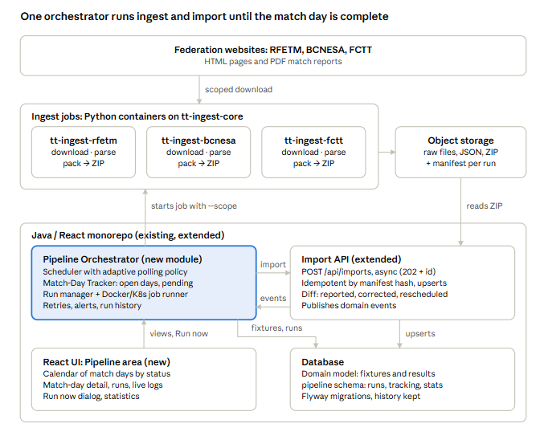

# Table Tennis Results Pipeline — Architecture Proposal

Oct 3, 2026 · @Albert

## Context and goals

The proposal keeps the existing scrapers, parsers and Java import logic, and adds one new module — a **Pipeline Orchestrator** — that decides *when* and *what* to refresh, runs the existing steps end to end, and tracks every match of the current match day until it is reported.

Today each federation (RFETM, BCNESA, FCTT) has its own Python repository with three manually invoked steps: download HTML/PDF into a folder tree, parse into JSON following a shared schema, and pack everything into one ZIP. A person then uploads each ZIP through the React frontend, and the Java backend imports it into the domain model through its REST APIs.

The target state must:

1. Run download → parse → pack → import with no user assistance.
2. Detect the current match day per federation, category, group and phase, and keep refreshing until every match of that match day has a reported result.
3. Track not-yet-played and not-yet-reported matches, re-triggering on a schedule until the match day is closed.
4. Show reported and pending matches on a calendar UI, with a manual trigger alongside the scheduled one.
5. Keep a history of every update run and statistics over time.

Design principles: reuse what works, make every step idempotent and scoped (only the competitions that are still open), and keep the domain model as the single source of truth for what is "reported".

## Target architecture

The orchestrator sits inside the Java monorepo, starts the federation ingest containers with a scope of open groups, hands the resulting ZIP to an extended import API, and reads the domain model back to decide what is still pending.

&#91;embedded content: target architecture · ingest jobs, orchestrator, import API, UI\]


Read it bottom up: the operator watches the calendar in the React UI; the orchestrator decides which groups are due, runs the matching ingest container, and calls the import API, whose domain events and the database tell it which matches are still missing.

## Changes to the Python repositories

The three repositories stay separate (each federation's site has its own quirks), but they converge on one shared core library and one identical command-line contract, so the orchestrator can drive all three the same way.

**1. Extract a shared library (`tt-ingest-core`).** Move what is common into a versioned package published to a private index or installed from Git: the JSON schema and its validator, ZIP packaging, manifest writing, HTTP client with retries and rate limiting, content hashing, and logging. Each federation repo depends on it and keeps only its federation-specific downloader and parser.

**2. One CLI contract for all three.** Every repo exposes the same entry point, so the orchestrator never needs federation-specific logic:

```
tt-ingest run --federation FCTT --season 2026-27 \
  --scope '{"competitions":[...],"groups":[...],"matchday":7}' \
  --since-manifest s3://.../last-manifest.json \
  --out s3://.../runs/<runId>/
```

Subcommands `download`, `parse`, `pack` remain for debugging; `run` chains them. Exit codes are standardised (0 ok, 2 nothing changed, 3 source unavailable, 4 parse error).

**3. Scoped, incremental runs.** Today the scripts download everything. The `--scope` argument limits a run to the categories, groups and phases still open on the current match day, which is what makes polling several times a day cheap and polite to the federation websites. Store an ETag / Last-Modified / SHA-256 per source URL; unchanged sources are skipped, and if nothing changed the run exits with code 2 and no ZIP is produced.

**4. A manifest inside every ZIP.** Add `manifest.json` at the ZIP root: federation, season, scope, run id, generator version, schema version, list of JSON files with hashes, source URLs with fetch timestamps, and per-match counts (`expected`, `withResult`, `pending`). The backend uses it for idempotency and the orchestrator uses it for quick progress checks.

**5. Calendar extraction as a first-class output.** The parsers must emit the *full fixture list* (scheduled date, venue, home/away, status) for each group, not only played results. Without fixtures there is nothing to compare against, so "pending" cannot be computed.

**6. Package as containers.** One Docker image per federation (`tt-ingest-rfetm`, `tt-ingest-bcnesa`, `tt-ingest-fctt`), built by CI on every merge. Raw HTML/PDF and ZIPs go to object storage (S3, MinIO or a mounted volume) instead of the local folder tree, keyed by `federation/season/runId/`.

## New module: Pipeline Orchestrator

Add a new module `pipeline-orchestrator` to the Java monorepo (a Spring Boot module, deployed beside the existing backend or as its own service). Putting it in the monorepo means it shares the domain model, the database and the React app, and the team does not have to run a separate workflow platform.

**Responsibilities**

- **Scheduler.** A cron-like tick (Quartz or Spring `@Scheduled` + ShedLock so only one instance fires) that every few minutes asks the Match-Day Tracker which federation scopes are due for a refresh.
- **Run manager.** Creates a `PipelineRun` per federation and scope, drives it through its steps and records every transition. Manual triggers from the UI create runs through the same path, with `trigger = MANUAL` and the user's id.
- **Job runner.** Executes the federation's ingest container with the CLI contract above. Implement behind a `JobRunner` interface with two adapters: `DockerJobRunner` (Docker Engine API, good for a single VM) and `KubernetesJobRunner` (a K8s `Job` per run). Logs are streamed and stored per step.
- **Importer client.** When a ZIP is produced, calls the backend's new async import API (next sections), polls for completion and stores the import report.
- **Concurrency and safety.** At most one active run per federation (a DB row lock or unique constraint on `federation + status in (QUEUED, RUNNING)`). A manual trigger while a run is active is either queued or rejected with a clear message. Each step has a timeout and up to 3 retries with exponential back-off for transient errors (exit code 3).
- **Notifications.** Optional e-mail / Telegram / Slack message when a match day closes, when a run fails twice in a row, or when a match stays unreported for longer than a threshold.

**Run lifecycle**

| State | Meaning | Next |
| --- | --- | --- |
| QUEUED | Created by scheduler or user, waiting for a free slot | RUNNING\_INGEST |
| RUNNING\_INGEST | Container downloading, parsing, packing | NO\_CHANGES, PACKED, FAILED |
| NO\_CHANGES | Sources unchanged since last manifest (exit 2) | SUCCEEDED |
| PACKED | ZIP and manifest stored | IMPORTING |
| IMPORTING | Backend import job running | SUCCEEDED, PARTIAL, FAILED |
| SUCCEEDED / PARTIAL / FAILED | Final; PARTIAL = imported with validation warnings | — |

After a final state the orchestrator asks the tracker to recompute match-day progress, which decides when the next run for that scope is due.

## Match-day detection and pending tracking

A **Match-Day Tracker** component (inside the orchestrator) reads the fixtures already in the domain model and decides, per federation, which groups are open and how often to poll them. The domain model is the source of truth: a match is "reported" only once its result has been imported.

**Identifying the current match day.** Each group's fixtures carry a match-day number (jornada) and scheduled dates. The tracker derives a *window* per match day and group: from the earliest to the latest scheduled date, plus a grace period (default 7 days). A match day is **open** when today is inside its window or when it still has unreported matches. Several match days can be open at once — for example last week's with a postponed match and this week's — so the tracker works on the set of open match days, not a single "current" one.

**Expected-match status.** Every fixture is classified on each recompute:

| Status | Rule |
| --- | --- |
| SCHEDULED | Scheduled date in the future |
| AWAITING\_RESULT | Scheduled date passed, no result yet, within grace period |
| REPORTED | Result imported (score, and individual games where the source has them) |
| POSTPONED | Source shows a new date; tracking moves to the new date |
| CANCELLED / WALKOVER | Source marks it as not played or awarded |
| OVERDUE | Past grace period with no result; flagged for manual review |

**Completion criteria.** A match day closes for a group when every fixture is REPORTED, CANCELLED or WALKOVER, or has been POSTPONED out of the window (it then keeps being tracked on its own). A user can also close it manually or mark a match "ignore". When all groups of a federation's match day are closed, the match day closes and a summary is stored.

**Adaptive polling.** The interval depends on how close the scope is to its matches, and backs off when the source keeps returning "no changes". Defaults, configurable per federation:

| Situation | Poll interval |
| --- | --- |
| No open match day; weekly calendar refresh | Once a week (full scope) |
| Open match day, no match today | Once a day |
| Match day with matches today, from 2 h after first start to midnight | Every 1–2 h |
| Day after matches | Every 3 h |
| 2–7 days after | Twice a day |
| Matches OVERDUE | Once a day up to 21 days, then stop and alert |
| 3 consecutive NO\_CHANGES | Double the interval, up to the next level |

**Scope building.** For each due federation the tracker builds the `--scope` argument from the groups that hold open matches, so a run downloads only those pages and PDFs. A weekly full-scope run (and one at season start) picks up new phases, re-draws and fixture changes.

## Changes to the Java backend import

The existing import logic stays; it gets an asynchronous, machine-friendly API around it and returns a structured report of what changed.

**1. Async import API.** Keep the current upload endpoint for manual use and add:

| Endpoint | Purpose |
| --- | --- |
| `POST /api/imports` | Body: ZIP location (object-storage key) or multipart upload, plus `runId`. Returns `202` with `importId` |
| `GET /api/imports/{importId}` | Status (`QUEUED`, `RUNNING`, `DONE`, `FAILED`) and the import report |
| `GET /api/imports?federation=&from=&to=` | History for the UI |

Imports run on a bounded executor (or Spring Batch if the ZIPs are large), one at a time per federation to avoid concurrent writes on the same competition.

**2. Idempotency.** Use the manifest's content hash as an idempotency key: the same ZIP imported twice is a no-op. Inside the import, upsert by natural keys (federation + season + competition + group + match-day + home + away, or the source's own match id when it has one), so re-importing a scope never duplicates matches.

**3. Import report with a diff.** Return per import: matches created, results newly reported, results corrected (score changed after being reported), fixtures rescheduled, standings recomputed, validation warnings. Results corrected after first report are worth a highlight in the UI, because federations do amend results.

**4. Domain events.** Publish `MatchResultReported`, `MatchRescheduled` and `ImportCompleted` (Spring application events to start with; a message broker only if other consumers appear). The Match-Day Tracker listens to them to recompute progress immediately instead of waiting for its next tick.

**5. Service-to-service auth.** The orchestrator calls the import API with a service account (client-credentials token or an API key with an `IMPORT` scope), separate from user logins.

If the orchestrator is deployed inside the same Spring Boot application, items 1 and 5 can be in-process calls instead of HTTP; keeping the REST contract anyway makes it easy to split later.

## Tracking data model

New tables live in a separate schema (`pipeline`) in the existing database, linked to the domain model by foreign keys. They hold operational state and history; they never duplicate results.

| Table | Key columns | Purpose |
| --- | --- | --- |
| `match_day` | federation, season, competition, group, phase, number, window\_start, window\_end, status (OPEN / CLOSED / CLOSED\_MANUALLY), closed\_at | One row per match day and group; drives the calendar |
| `match_tracking` | match\_id (FK to domain), match\_day\_id, status (see tracker), first\_seen\_at, reported\_at, last\_changed\_at, ignore\_flag, note | Per-match progress; reported\_at gives time-to-report |
| `poll_schedule` | federation, scope\_hash, next\_run\_at, interval, consecutive\_no\_change, policy\_level | Adaptive polling state per scope |
| `pipeline_run` | id, federation, scope (JSON), trigger (SCHEDULED / MANUAL / RETRY), requested\_by, status, started\_at, finished\_at, error | One row per end-to-end run |
| `pipeline_step` | run\_id, step (DOWNLOAD / PARSE / PACK / IMPORT), status, started\_at, finished\_at, exit\_code, log\_ref, attempt | Step timing and logs |
| `run_artifact` | run\_id, kind (RAW / JSON / ZIP / MANIFEST), storage\_key, sha256, size\_bytes | Where each output is stored |
| `import_report` | run\_id, import\_id, created, reported, corrected, rescheduled, warnings (JSON) | Diff returned by the backend |
| `source_fetch` | federation, url, etag, last\_modified, sha256, fetched\_at, http\_status | Incremental downloads and source-health stats |
| `daily_stats` | date, federation, runs, failures, matches\_reported, avg\_time\_to\_report, pending\_end\_of\_day | Pre-aggregated figures for dashboards |

Use Flyway or Liquibase migrations in the monorepo. Raw files and ZIPs are kept in object storage with a retention rule (for example raw HTML/PDF 90 days, ZIPs and manifests for the whole season), so any past state can be re-imported.

## React UI: pipeline control centre

Add a "Pipeline" area to the existing React frontend with four views, fed by new read endpoints on the orchestrator (`/api/pipeline/...`) and live updates over Server-Sent Events or WebSocket so run progress appears without refreshing.

**1. Calendar view (home).** A month / week calendar (FullCalendar or react-big-calendar) with one entry per match day and group, filterable by federation, season, category and phase. Each entry is coloured by completion (green = all reported, amber = in progress, red = has OVERDUE matches, grey = future) and shows a counter such as `14 / 16 reported`. Days with scheduled runs show a small marker; clicking a past run opens its detail.

**2. Match-day detail.** Opened from the calendar: the list of matches with home, away, scheduled date, status chip, result and "reported at". Actions: refresh just this group now, mark a match as ignored / cancelled, close the match day manually, add a note. A timeline under the list shows every run that touched this match day and what it changed.

**3. Runs and manual trigger.** A table of runs (newest first) with trigger, scope, duration, step badges and outcome, plus a live log panel for the running one. A **Run now** button opens a small dialog: federation (one or all), scope (open match days / a chosen group / full season), and an option to force a full download ignoring cached hashes. Manual runs go through the same queue and appear in the same table.

**4. Statistics dashboard.** Charts over the season (see next section) and a source-health panel per federation website.

Access: viewing for all logged-in users, triggering and closing match days for an `OPERATOR` role, policy settings (poll intervals, grace period, alerts) for `ADMIN`.

## History, statistics and observability

Every run, step, artifact and import diff is kept, so the history answers "when did this result arrive, from which run, and what did it change".

**Statistics to show** (from `daily_stats` plus on-demand queries):

- Reporting progress per match day: reported vs pending over the days of the window.
- Time to report: hours from scheduled match time to first import of its result, per federation and category (median and 90th percentile).
- Matches still pending, by age, and OVERDUE count per federation.
- Results corrected after first report, per federation.
- Runs per day by outcome (succeeded, no changes, partial, failed) and average duration per step.
- Source health: HTTP errors, timeouts and parse errors per federation website, which shows quickly when a site changes its layout.

**Operational observability.** Spring Boot Actuator + Micrometer metrics exported to Prometheus with a Grafana board for technical metrics; structured JSON logs from the Python containers with the `runId` on every line, collected in Loki or the existing log stack. Alerts on: two consecutive failed runs for a federation, parse error rate above zero after a site change, and no successful run in 24 h during an open match day.

**Audit and replay.** Because ZIPs and manifests are retained, any run can be re-imported from the UI ("replay import"), which helps after a parser fix: re-run parse on stored raw files without downloading again.

## Technology options

Recommended: **Option A**, a custom orchestrator module in the Java monorepo. The domain-specific logic (match days, pending matches, adaptive polling, the calendar UI) is the hard part and must be written anyway; a generic workflow engine would only replace the simple run state machine while adding a second platform and a second UI.

| Option | How it works | Pros | Cons |
| --- | --- | --- | --- |
| A. Spring Boot orchestrator module (recommended) | Quartz/ShedLock scheduler, DB-backed run state, Docker or K8s job runner | One codebase, one DB, UI integrated in the existing React app, direct access to the domain model | Retries, queues and log handling written by hand (small scope) |
| B. Airflow / Prefect / Dagster | Python DAG per federation; match-day logic in Python; calls the Java import API | Mature retries, scheduling, logs and UI out of the box; Python teams know it | A second platform to run; the match-day calendar still needs a custom UI; tracker logic must read the domain model across services |
| C. Temporal | Durable workflow per match day that sleeps and wakes until complete | Models "keep polling until all matches reported" very naturally | Heaviest operational footprint; steeper learning curve |
| D. GitHub Actions / GitLab CI cron | Scheduled pipeline runs the scrapers and calls the import API | Quickest to start, no new server | No real state per match, limited minute-level scheduling, no UI; fine only as a phase-1 stop-gap |

Supporting choices for Option A: PostgreSQL (or the existing DB) for state; MinIO or S3 for artifacts; Docker Compose for a single-VM setup, Kubernetes if it already exists; GitHub/GitLab CI to build the three ingest images and the monorepo.

## Rollout plan

Five phases, each usable on its own, so manual work drops after phase 2 even before the calendar UI exists. Start with the federation whose site is most stable, then add the other two.

1. **Standardise ingest.** Extract `tt-ingest-core`, add the `run` CLI, `manifest.json`, fixture output, object-storage output and Docker images. Exit: all three repos produce identical-format ZIPs from one command.
2. **Headless automation.** Add the async import API with idempotency and import reports; add the orchestrator with a fixed schedule (for example every 3 h on match weekends) and full scope. Exit: no manual uploads needed.
3. **Match-day tracking.** Add the tracking schema, the Match-Day Tracker, scoped runs and adaptive polling. Exit: runs stop by themselves when a match day is complete; OVERDUE matches alert.
4. **Control-centre UI.** Calendar, match-day detail, runs table with live logs, Run now dialog, roles. Exit: an operator can follow and steer a match day without touching a server.
5. **History and statistics.** `daily_stats` aggregation, statistics dashboard, Grafana board, replay import. Exit: season-level reporting on timeliness and source health.

## Risks and open questions

| Risk | Mitigation |
| --- | --- |
| A federation website changes its HTML or PDF layout and parsing silently returns fewer matches | Compare parsed match count against expected fixtures; alert on drop; keep raw files for replay after the fix |
| Too-frequent polling gets the scraper blocked | Scoped runs, conditional requests (ETag/Last-Modified), rate limit in the shared client, honest User-Agent, back-off on NO\_CHANGES |
| Results amended after being reported overwrite earlier data unnoticed | Import diff records corrections; UI highlights them |
| Postponed matches keep a match day open for weeks | Postponed matches tracked individually; match day closes when the rest is complete |
| Concurrent manual and scheduled runs for the same federation | One active run per federation, enforced in the DB |
| Matches with no fixture in the source (friendly, play-off added late) | Weekly full-scope refresh; unknown matches created on import and attached to their match day |

Open questions:

- [ ] Where will it run: a single VM with Docker Compose, or an existing Kubernetes cluster?
- [ ] Do all three sources publish full fixtures (with dates) for every category, or only results for some?
- [ ] Are individual game scores (sets, singles/doubles) required before a match counts as reported, or is the final team score enough?
- [ ] Which notification channel should alerts use?
- [ ] Grace period before OVERDUE: is 7 days right for all three federations?
