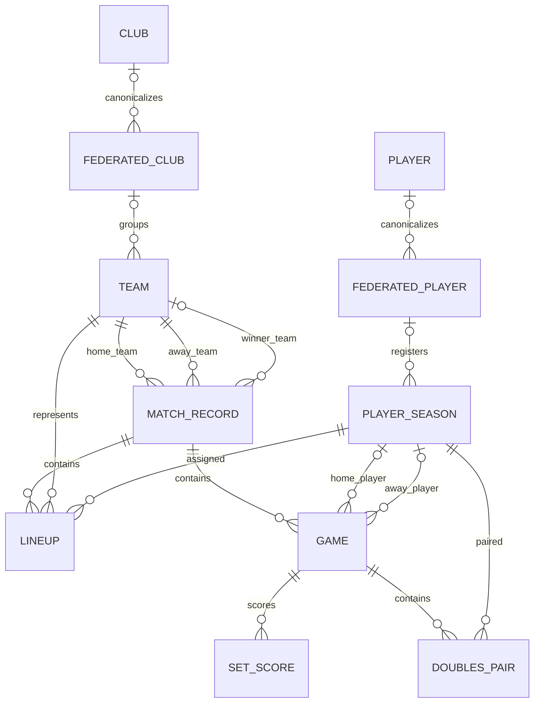

# RFETM Relational Data Model

## Scope and JPA conventions

This document describes the relational model implemented by the JPA entities in
`tt-data-league-core-repository-jpa`. It includes imported league data and the
application authentication tables.

- Entities use Jakarta Persistence and application-assigned `UUID` identifiers.
  No entity configures `@GeneratedValue`.
- Enum fields use `@Enumerated(EnumType.STRING)`.
- Every `@ManyToOne` association is lazy and owns its explicit join column.
- No entity currently declares a `@OneToMany` collection. `MATCH` and `GAME`
  children are loaded through their repositories.
- Unless a column is explicitly marked otherwise below, its nullability and
  length are those declared by the entity.
- `source` is stored as a string enum with the values `RFETM`, `BCNESA`, and
  `FCTT`.
- `MATCH` is persisted as `match_record` to avoid a reserved-word collision.

## Enumerations

| Enum | Stored values |
| --- | --- |
| `Source` | `RFETM`, `BCNESA`, `FCTT` |
| `GameType` | `INDIVIDUAL`, `DOUBLES` |
| `MatchResult` | `HOME`, `AWAY` |
| `Side` | `HOME`, `AWAY` |
| `UserRole` | `ADMIN`, `CLUB_MANAGER`, `ANALYST`, `PRACTITIONER` |

## League tables

### `import_resource`

Import metadata associated with a stored resource.

| Column | Type | Null | Key/index |
| --- | --- | --- | --- |
| `id` | `UUID` | No | Primary key |
| `resource_id` | `UUID` | No | FK to `resource` |
| `valid` | `BOOLEAN` | Yes | — |
| `type` | `VARCHAR` | No | Enum string |
| `created` | `TIMESTAMP WITH TIME ZONE` | No | — |
| `last_processed_date` | `TIMESTAMP WITH TIME ZONE` | Yes | — |

The `resource` association is a lazy `@OneToOne` with no cascade.

### `club`

Season-independent canonical club identity.

| Column | Type | Null | Key/index |
| --- | --- | --- | --- |
| `id` | `UUID` | No | Primary key |
| `name` | `VARCHAR(255)` | No | Unique; `idx_club_name` |

The table constraint is `uk_club_name`.

### `federated_club`

Source-specific club identity, optionally linked to a canonical `club`.

| Column | Type | Null | Key/index |
| --- | --- | --- | --- |
| `id` | `UUID` | No | Primary key |
| `source` | `VARCHAR(20)` | No | — |
| `name` | `VARCHAR(255)` | Yes | — |
| `club_id` | `UUID` | Yes | FK to `club`; `idx_federated_club_club_id` |

The unique constraint `uk_federated_club_source_name` covers
`(source, name)`. The indexes `idx_federated_club_name` and
`idx_federated_club_source_name` support name and source-scoped name lookup.
The `club` association is `@ManyToOne(fetch = LAZY)` with no cascade.

### `team`

Season-specific team registration, optionally linked to a source-specific
federated club.

| Column | Type | Null | Key/index |
| --- | --- | --- | --- |
| `id` | `UUID` | No | Primary key |
| `source` | `VARCHAR(20)` | Yes | — |
| `name` | `VARCHAR(255)` | Yes | — |
| `season` | `VARCHAR(10)` | Yes | — |
| `federated_club_id` | `UUID` | Yes | FK to `federated_club`; `idx_team_federated_club_id` |

The unique constraint `uk_team_name_season_source` covers
`(name, season, source)`. `idx_team_name_season` covers `(name, season)`.
The `federatedClub` association is `@ManyToOne(fetch = LAZY)` with no cascade.

### `player`

Season-independent canonical player identity. `license_id` stores the imported
source licence when available.

| Column | Type | Null | Key/index |
| --- | --- | --- | --- |
| `id` | `UUID` | No | Primary key |
| `name` | `VARCHAR(255)` | No | Unique; `idx_player_name` |
| `license_id` | `VARCHAR(20)` | Yes | — |

The table constraint is `uk_player_name`.

### `federated_player`

Source-specific player identity, optionally linked to a canonical `player`.
`license_id` stores the imported source licence when available.

| Column | Type | Null | Key/index |
| --- | --- | --- | --- |
| `id` | `UUID` | No | Primary key |
| `source` | `VARCHAR(20)` | No | — |
| `name` | `VARCHAR(255)` | No | — |
| `license_id` | `VARCHAR(20)` | Yes | `idx_federated_player_source_license` with `source` |
| `player_id` | `UUID` | Yes | FK to `player`; `idx_federated_player_player_id` |

There is no table-level unique constraint on `(source, name)`. The indexes
`idx_federated_player_name` and `idx_federated_player_source_name` support
unscoped and source-scoped searches. The `player` association is
`@ManyToOne(fetch = LAZY)` with no cascade.

### `player_season`

Season-specific player registration. `license_id` is the source-system
registration identifier.

| Column | Type | Null | Key/index |
| --- | --- | --- | --- |
| `id` | `UUID` | No | Primary key |
| `source` | `VARCHAR(20)` | No | — |
| `name` | `VARCHAR(255)` | No | `idx_player_season_name` |
| `license_id` | `VARCHAR(20)` | No | — |
| `season` | `VARCHAR(10)` | Yes | `idx_player_season_season_license` |
| `federated_player_id` | `UUID` | Yes | FK to `federated_player`; `idx_player_season_federated_player_id` |

The unique constraint `uk_player_season_source_season_license` covers
`(source, season, name, license_id)`. The `federatedPlayer` association is
`@ManyToOne(fetch = LAZY)` with no cascade.

### `match_record`

Top-level team match event.

| Column | Type | Null | Key/index |
| --- | --- | --- | --- |
| `id` | `UUID` | No | Primary key |
| `source` | `VARCHAR(20)` | No | — |
| `external_id` | `VARCHAR(20)` | Yes | Unique; `idx_match_external_id` |
| `competition` | `VARCHAR(255)` | Yes | `idx_match_competition_season_group_round` |
| `season` | `VARCHAR(9)` | Yes | `idx_match_competition_season_group_round` |
| `group_num` | `INTEGER` | No | `idx_match_competition_season_group_round` |
| `round` | `INTEGER` | No | `idx_match_competition_season_group_round` |
| `match_date` | `DATE` | Yes | — |
| `match_time` | `TIME` | Yes | — |
| `city` | `VARCHAR(255)` | Yes | — |
| `venue` | `VARCHAR(255)` | Yes | — |
| `home_team_id` | `UUID` | No | FK to `team`; `idx_match_home_team_id` |
| `away_team_id` | `UUID` | No | FK to `team`; `idx_match_away_team_id` |
| `referee_name` | `VARCHAR(255)` | Yes | — |
| `referee_license` | `VARCHAR(20)` | Yes | — |
| `home_games_won` | `INTEGER` | Yes | — |
| `away_games_won` | `INTEGER` | Yes | — |
| `home_sets_won` | `INTEGER` | Yes | — |
| `away_sets_won` | `INTEGER` | Yes | — |
| `winner_team_id` | `UUID` | Yes | FK to `team`; `idx_match_winner_team_id` |
| `protested` | `BOOLEAN` | No | Database default `false` |

The unique constraints are:

- `uk_competition_season_group_round_teams` on
  `(competition, season, group_num, round, home_team_id, away_team_id)`.
- `uk_match_external_id` on `(external_id)`.

`homeTeam`, `awayTeam`, and `winnerTeam` are lazy `@ManyToOne` associations
to `team`. The winner association is nullable.

### `lineup`

Player assignment to a team and position in a match.

| Column | Type | Null | Key/index |
| --- | --- | --- | --- |
| `id` | `UUID` | No | Primary key |
| `source` | `VARCHAR(20)` | Yes | — |
| `match_id` | `UUID` | No | FK to `match_record`; `idx_lineup_match_id` |
| `team_id` | `UUID` | No | FK to `team`; `idx_lineup_team_id` |
| `letter` | `VARCHAR(2)` | No | — |
| `position` | `INTEGER` | No | — |
| `player_id` | `UUID` | No | FK to `player_season`; `idx_lineup_player_id` |
| `ranking` | `DECIMAL(10,2)` | Yes | — |

The unique constraint `uk_match_team_letter_position` covers
`(match_id, team_id, letter, position)`. `match`, `team`, and `player` are
lazy `@ManyToOne` associations.

### `game`

Individual singles or doubles game within a match.

| Column | Type | Null | Key/index |
| --- | --- | --- | --- |
| `id` | `UUID` | No | Primary key |
| `source` | `VARCHAR(20)` | No | — |
| `match_id` | `UUID` | No | FK to `match_record`; `idx_game_match_id` |
| `game_number` | `INTEGER` | No | Unique within match |
| `type` | `VARCHAR(10)` | No | `INDIVIDUAL` or `DOUBLES` |
| `crossover` | `VARCHAR(20)` | No | — |
| `home_player_id` | `UUID` | Yes | FK to `player_season`; `idx_game_home_player_id` |
| `away_player_id` | `UUID` | Yes | FK to `player_season`; `idx_game_away_player_id` |
| `home_sets_won` | `INTEGER` | Yes | — |
| `away_sets_won` | `INTEGER` | Yes | — |
| `winner` | `VARCHAR(4)` | Yes | `HOME` or `AWAY` |
| `cumul_home` | `INTEGER` | No | — |
| `cumul_away` | `INTEGER` | No | — |
| `not_played` | `BOOLEAN` | No | Database default `false` |
| `reason` | `VARCHAR(255)` | Yes | — |

The unique constraint `uk_match_game_number` covers `(match_id, game_number)`.
`match`, `homePlayer`, and `awayPlayer` are lazy `@ManyToOne` associations;
the player associations are nullable. `GameJPA` does not expose JPA
collections for sets or doubles pairs.

### `set_score`

Point score for one set in a game.

| Column | Type | Null | Key/index |
| --- | --- | --- | --- |
| `id` | `UUID` | No | Primary key |
| `source` | `VARCHAR(20)` | Yes | — |
| `game_id` | `UUID` | No | FK to `game`; `idx_set_score_game_id` |
| `set_number` | `INTEGER` | No | Unique within game |
| `home_points` | `INTEGER` | No | — |
| `away_points` | `INTEGER` | No | — |

The unique constraint `uk_set_score_game_set_number` covers
`(game_id, set_number)`. `game` is a lazy `@ManyToOne` association.

### `doubles_pair`

Player membership of a doubles game side.

| Column | Type | Null | Key/index |
| --- | --- | --- | --- |
| `id` | `UUID` | No | Primary key |
| `source` | `VARCHAR(20)` | Yes | — |
| `game_id` | `UUID` | No | FK to `game`; `idx_doubles_pair_game_id` |
| `side` | `VARCHAR(4)` | No | `HOME` or `AWAY` |
| `player_id` | `UUID` | No | FK to `player_season`; `idx_doubles_pair_player_id` |

The unique constraint `uk_doubles_pair_game_side_player_source` covers
`(game_id, side, player_id, source)`. `game` and `player` are lazy
`@ManyToOne` associations.

## Authentication tables

### `AppUser`

The entity declares the table name as `AppUser`.

| Column | Type | Null | Key/index |
| --- | --- | --- | --- |
| `id` | `UUID` | No | Primary key; not updatable |
| `username` | String | No | Unique; `idx_user_username` |
| `email` | String | No | Unique; `idx_user_email` |
| `password_hash` | String | No | — |
| `created_at` | `TIMESTAMP WITH TIME ZONE` | No | — |
| `is_active` | `BOOLEAN` | No | — |

`username` and `email` are unique both through their column mappings and the
unique indexes declared by `UserJPA`.

### `AppUserRole`

An element-collection table for `UserJPA.roles`, declared with
`@CollectionTable(name = "AppUserRole", joinColumns = @JoinColumn(name =
"user_id"))`.

| Column | Type | Null | Key/index |
| --- | --- | --- | --- |
| `user_id` | `UUID` | No | Join column to `AppUser.id` |
| `role` | `VARCHAR(30)` | No | Enum string |

The collection is initialized with the default role `PRACTITIONER`. No
explicit cascade or orphan-removal setting is declared on the collection.

### `PasswordRecoveryToken`

One-time password-recovery records. The raw token is not persisted; only its
SHA-256 hash is stored.

| Column | Type | Null | Key/index |
| --- | --- | --- | --- |
| `id` | `UUID` | No | Primary key; not updatable |
| `user_id` | `UUID` | No | Scalar user identifier |
| `token_hash` | `VARCHAR(64)` | No | Unique; `idx_recovery_token_hash` |
| `created_at` | `TIMESTAMP WITH TIME ZONE` | No | — |
| `expires_at` | `TIMESTAMP WITH TIME ZONE` | No | `idx_recovery_expiry` |
| `consumed` | `BOOLEAN` | No | — |

The table constraint is `uk_recovery_token_hash`. `user_id` is deliberately a
scalar UUID field; `PasswordRecoveryTokenJPA` does not declare a JPA
association to `UserJPA`.

## Repository lookup behavior

Spring Data helper repositories expose the following persistence lookups in
addition to ordinary CRUD operations:

| Repository | Lookup behavior |
| --- | --- |
| `ClubRepositoryHelper` | Exact canonical club name. |
| `PlayerRepositoryHelper` | Exact canonical player name. |
| `FederatedClubRepositoryHelper` | Source-scoped exact name, all rows by source, rows by canonical club id, and case-insensitive name searches; list results can be sorted. The adapter also supports fragment-based searches through specifications. |
| `FederatedPlayerRepositoryHelper` | Source-scoped exact name; the adapter also supports fragment-based searches through specifications. |
| `TeamRepositoryHelper` | Exact `(name, season, source)`, first team by federated club and season, all teams by source, and case-insensitive name searches with optional season/source. |
| `PlayerSeasonRepositoryHelper` | Exact `(source, license, season)`, all rows by source, and source-scoped players associated with team ids through lineups. |
| `MatchRepositoryHelper` | Exact external id; exact natural-key lookup by competition, season, group, round, home team, and away team; team-id searches optionally filtered by source, season, and competition. |
| `LineupRepositoryHelper` | All lineup rows for a match id. |
| `GameRepositoryHelper` | All games for a match id, or for a collection of match ids, ordered by match and `game_number` ascending. |
| `SetScoreRepositoryHelper` | CRUD only; no derived lookup method. |
| `DoublesPairRepositoryHelper` | All doubles-pair rows for a collection of game ids, ordered by game, side, and id. |
| `UserRepositoryHelper` | Exact username/email lookup and existence checks. |
| `PasswordRecoveryTokenRepositoryHelper` | Active token lookup by hash; atomic conditional consumption by token id or user id. |

Repository queries that traverse teams, players, lineups, or matches apply
source predicates where the operation is source-scoped. The database natural
keys remain the final integrity boundary; repository method names do not
replace the declared constraints.

## Entity relationship summary

The associations are owned by the child entities:

`SET_SCORE` and `DOUBLES_PAIR` point to `GAME` from their own entities.
Likewise, `MATCH_RECORD` and `GAME` do not expose inverse collection mappings.
Team and player season rows preserve season-specific identity; canonical club
and player links do not retarget historical match, lineup, game, or doubles
pair foreign keys.

## System settings

`system_settings` stores the administrator-managed allowlisted settings used by
the system settings panel. It is deliberately separate from deployment
configuration and never stores datasource credentials, JWT secrets, mail
credentials, or other secrets.

| Column | Type | Nullability | Notes |
|---|---|---|---|
| `key` | varchar(120) | not null | Primary key; one row per supported setting |
| `setting_type` | varchar(20) | not null | `BOOLEAN`, `INTEGER`, or `STRING` |
| `setting_value` | varchar(2000) | not null | Validated scalar value |
| `version` | bigint | not null | Optimistic version, incremented for each update |

Bulk updates and restores validate the complete operation before replacing
values. Restore is transactional and the versioned JSON backup format is
`{"schemaVersion":1,"settings":{"key":value}}`.

At startup, `SystemSettingsSchemaMigration` checks metadata and, when the
legacy table exists and the new table does not, executes `ALTER TABLE` renames
from `SystemSetting.setting_key` to `system_settings.key`. The operation is
data-preserving and idempotent; deployments must grant the application schema
user permission to rename the table and column.
