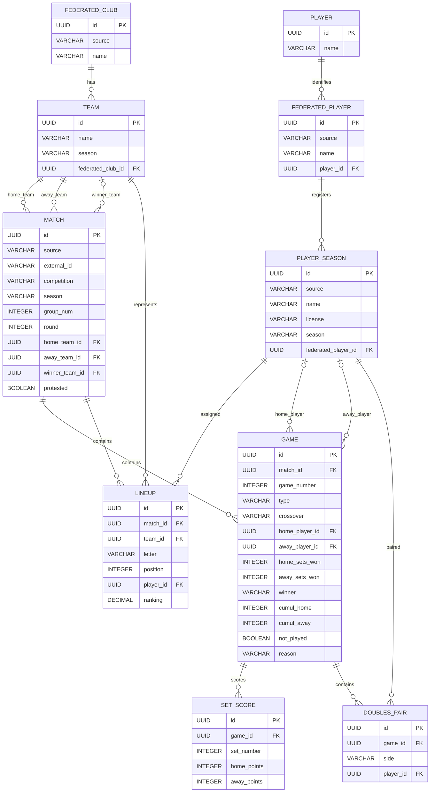

# RFETM Relational Data Model

## Context

This document defines the relational database model for imported table-tennis federation match records.

`source` is stored as an enum string. The supported source values are `RFETM`, `BCNESA`, and
`FCTT`; every source-scoped natural key remains scoped by this value.

The domain covers **team table tennis competitions**: two clubs meet in a **match** (the overall event), which consists of several individual **games** (singles and doubles). Each game is played as a best-of series of **sets**.

Use this specification to generate **Java JPA entity classes** with the following conventions:

- Use `jakarta.persistence` annotations (Jakarta EE 10+ / Spring Boot 3+).
- Annotate every entity with `@Entity` and `@Table(name = "...")`.
- Use `UUID` (Java `java.util.UUID`) for every entity identifier and identifier foreign key column.
- Each entity identifier must be a caller-provided UUID v4. Do not use `@GeneratedValue`; the application must assign the UUID before persistence.
- Use `@Column` annotations with `name`, `nullable`, `unique`, and `length` where specified.
- Map relationships with `@ManyToOne`, `@OneToMany`, `@JoinColumn`, and `mappedBy` as appropriate.
- Use `FetchType.LAZY` for all `@ManyToOne` and `@OneToMany` associations.
- Use `@Enumerated(EnumType.STRING)` for enum-typed columns.
- Composite natural keys should be enforced with `@UniqueConstraint` on the `@Table` annotation.
- Use Lombok accessors and constructors as present in each entity. Most entities use
  `@Getter`, `@Setter`, `@NoArgsConstructor`, and `@AllArgsConstructor`; `GameJPA`, `MatchJPA`, and
  `FederatedPlayerJPA` currently use `@RequiredArgsConstructor`.
- Use `org.cttelsamicsterrassa.data.core.repository.jpa` as the base package.
- Place each entity in its own subpackage named after the entity (for example, `TeamJPA` is in `org.cttelsamicsterrassa.data.core.repository.jpa.club`).
- Name each JPA entity after the table name in PascalCase with the `JPA` suffix.
- Place entity-specific enums in the corresponding entity package (for example, `GameType` and `MatchResult` are in `org.cttelsamicsterrassa.data.core.repository.jpa.game`).

---

## Enums

### `GameType`

Represents the modality of an individual game within a match.

| Value        | Description                     |
| ------------ | ------------------------------- |
| `INDIVIDUAL` | Singles match (one player each) |
| `DOUBLES`    | Doubles match (pair each side)  |

### `Side`

Represents a side in a match.

| Value  | Description |
| ------ | ----------- |
| `HOME` | Home side   |
| `AWAY` | Away side   |

### `MatchResult`

Represents the outcome of a game.

| Value  | Description    |
| ------ | -------------- |
| `HOME` | Home side wins |
| `AWAY` | Away side wins |

---

## Tables

### `FEDERATED_CLUB`

Represents a source-specific club identity. It may reference the
season-independent `CLUB` identity, but its source-provided name and UUID remain
unchanged.

| Column        | Type           | PK  | Nullable | Unique | Description                                                     |
| ------------- | -------------- | --- | -------- | ------ | --------------------------------------------------------------- |
| `id`          | `UUID`         | Yes | No       | Yes    | Surrogate primary key (caller-provided UUID v4).                 |
| `source`      | `VARCHAR(20)`  | No  | No       | No     | Federation that supplied the club row.                            |
| `name`        | `VARCHAR(255)` | No  | Yes      | No     | Club name. Can be null for unknown clubs.                        |
| `club_id`     | `UUID`         | No  | Yes      | No     | Nullable foreign key to `CLUB`; populated by the manual migration/backfill. |

FederatedClub and FederatedPlayer entities do not persist source-system identifiers. Their UUID is the entity identity;
`source` scopes federation data. FederatedClub retains its `(source, name)` uniqueness constraint, while
FederatedPlayer does not. RFETM team keys and
player licences are retained by the import and season-registration flows where they are needed for
source-specific matching.

---

### `CLUB`

Represents the canonical, season-independent club identity. Its display name
is globally unique and is the only automatic cross-source matching key.

| Column | Type | PK | Nullable | Unique | Description |
| ------ | ---- | -- | -------- | ------ | ----------- |
| `id` | `UUID` | Yes | No | Yes | Caller-provided UUID v4. |
| `name` | `VARCHAR(255)` | No | No | Yes | Exact canonical display name. |

`FEDERATED_CLUB.club_id` is a lazy, nullable many-to-one relationship. No
cascade is defined: canonical clubs must be created before their federated
references. `TEAM.federated_club_id` and all match, lineup, and
player-season references continue to target the federated/season-specific
records and are not redirected to `CLUB`.

---

## Existing database migration requirement

The entity rename requires a database migration for existing deployments before
starting the renamed application. The earlier migration must rename `club` to
`federated_club`, rename `team.club_id` to `team.federated_club_id`, rename
`player` to `federated_player`, and rename `player_season.player_id` to
`player_season.federated_player_id`. It must also rename the related indexes,
foreign keys, and constraints while preserving UUIDs, row data, row counts, and
references. `LINEUP.player_id`, `GAME.home_player_id`, `GAME.away_player_id`,
and `DOUBLES_PAIR.player_id` target `PLAYER_SEASON` and must remain unchanged.

This repository owns the manually applied PostgreSQL migration
`docs/migrations/FEAT-008-canonical-club.sql`. It includes prechecks,
backfill-safe nullable steps, and postchecks for row counts, UUIDs, names,
references, and foreign-key integrity. Apply it before starting either runtime;
the runtime datasource uses `DB_TTLEAGUEDATA_JDBC_URL`,
`DB_TTLEAGUEDATA_CREDENTIAL_USERNAME`, and
`DB_TTLEAGUEDATA_CREDENTIAL_PASSWORD`.

Hibernate `ddl-auto: update` is not a migration and must not be used to rename
tables, preserve data, or perform this backfill.

---

### `APPUSER`

Application users are stored separately from imported league data. Password
hashes are persisted, never plaintext credentials. `AppUserRole` stores the
source role assignments and is joined to `AppUser` by `user_id`; roles are
stored as enum strings (`ADMIN`, `CLUB_MANAGER`, `ANALYST`, or `PRACTITIONER`).

### `PASSWORDRECOVERYTOKEN`

Password recovery records contain only a SHA-256 hash of the one-time token.
The raw token is delivered through the configured email adapter and is never
returned by the REST API or written to application logs.

| Column       | Type         | PK  | Nullable | Unique | Description |
| ------------ | ------------ | --- | -------- | ------ | ----------- |
| `id`         | `UUID`       | Yes | No       | Yes    | Recovery record identifier. |
| `user_id`    | `UUID`       | No  | No       | No     | Identifier of the `AppUser` receiving recovery instructions. |
| `token_hash` | `VARCHAR(64)`| No  | No       | Yes    | SHA-256 digest of the raw recovery token. |
| `created_at` | `TIMESTAMP`  | No  | No       | No     | Token creation time. |
| `expires_at` | `TIMESTAMP`  | No  | No       | No     | Expiration time. |
| `consumed`   | `BOOLEAN`    | No  | No       | No     | Whether the token has already been used. |

`idx_recovery_token_hash` supports token lookup and `idx_recovery_expiry`
supports expiry maintenance. A token is usable only when it is unconsumed and
unexpired; consuming it is an atomic conditional update.

---

### `FEDERATED_PLAYER`

Represents a source-specific player identity. Its UUID, source, and source-provided
name remain unchanged; it may reference the season-independent `PLAYER` identity.

| Column        | Type           | PK  | Nullable | Unique | Description                                                                    |
| ------------- | -------------- | --- | -------- | ------ | ------------------------------------------------------------------------------ |
| `id`          | `UUID`         | Yes | No       | Yes    | Surrogate primary key (caller-provided UUID v4).                               |
| `source`      | `VARCHAR(20)`  | No  | No       | No     | Federation that supplied the player row.                                       |
| `name`        | `VARCHAR(255)` | No  | No       | No     | Full name in "SURNAME, FIRSTNAME" format.                                      |
| `player_id`   | `UUID`         | No  | Yes      | No     | Nullable foreign key to `PLAYER`; populated by the manual migration/backfill.  |

The `source` and `name` columns are not subject to a unique constraint. Federation licence identity
is represented by the `PLAYER_SEASON` `(source, season, license)` constraint.

- `idx_federated_player_name` indexes `name`.
- `idx_federated_player_source_name` indexes `(source, name)` for scoped lookup; it is not unique.
- `idx_federated_player_player_id` indexes `player_id`.

`FEDERATED_PLAYER.player_id` is a lazy, nullable many-to-one relationship with
no cascade. Canonical players must be created before their federated references.

---

### `PLAYER`

Represents the globally unique, season-independent canonical identity of a player.
Its exact display name is the only automatic cross-source linking key.

| Column | Type | PK | Nullable | Unique | Description |
| ------ | ---- | -- | -------- | ------ | ----------- |
| `id` | `UUID` | Yes | No | Yes | Caller-provided UUID v4. |
| `name` | `VARCHAR(255)` | No | No | Yes | Exact canonical display name. |

`uk_player_name` enforces global exact-name uniqueness and `idx_player_name`
supports canonical-name lookup. Federation licences remain on
`PLAYER_SEASON`; `PLAYER_SEASON.federated_player_id` and all match, lineup, and
doubles-pair references continue to target their existing season-specific rows.

---

### `TEAM`

Represents a club's season-specific registration. A team keeps its own UUID and
season data and may reference the season-independent `FEDERATED_CLUB` row
through `federated_club_id`.

| Column   | Type           | PK  | Nullable | Unique | FK Target | Description |
| -------- | -------------- | --- | -------- | ------ | --------- | ----------- |
| `id`     | `UUID`         | Yes | No       | Yes    |           | Caller-provided UUID v4. |
| `source` | `VARCHAR(20)`  | No  | Yes      | No     |           | Federation that supplied the team row. |
| `name`   | `VARCHAR(255)` | No  | Yes      | No     |           | Team name for the season. |
| `season` | `VARCHAR(10)`  | No  | Yes      | No     |           | Season label. |
| `federated_club_id` | `UUID`        | No  | Yes      | No     | `FEDERATED_CLUB.id` | Optional canonical club association. |

**Constraints:**

- `uk_team_name_season_source` is unique on `(name, season, source)`.
- `idx_team_name_season` indexes `(name, season)`.
- `idx_team_federated_club_id` indexes `federated_club_id`.

---

### `MATCH`

Represents a team match event. This is the top-level aggregate: an encounter between a home team and an away team within a competition round. A match typically contains 5–7 individual games.

| Column            | Type           | PK  | Nullable | Unique | FK Target  | Description                                                                |
| ----------------- | -------------- | --- | -------- | ------ | ---------- | -------------------------------------------------------------------------- |
| `id`              | `UUID`         | Yes | No       | Yes    |            | Surrogate primary key (caller-provided UUID v4).                          |
| `source`          | `VARCHAR(20)`  | No  | No       | No     |            | Federation that supplied the match record.                                |
| `external_id`     | `VARCHAR(20)`  | No  | Yes      | Yes    |            | Source-system match identifier, when the source provides one.             |
| `competition`     | `VARCHAR(255)` | No  | Yes      | No     |            | Competition name, category, and gender (e.g. "Superdivisión Masculina").   |
| `season`          | `VARCHAR(9)`   | No  | Yes      | No     |            | Season label in `YYYY/YYYY` format (e.g. "2025/2026").                     |
| `group_num`       | `INTEGER`      | No  | No       | No     |            | Group number within the competition. 0 if not applicable.                  |
| `round`           | `INTEGER`      | No  | No       | No     |            | Round (matchday) number within the league.                                 |
| `match_date`      | `DATE`         | No  | Yes      | No     |            | Date of the match (ISO 8601).                                              |
| `match_time`      | `TIME`         | No  | Yes      | No     |            | Scheduled start time (24h format).                                         |
| `city`            | `VARCHAR(255)` | No  | Yes      | No     |            | City (and province) where the match was played.                            |
| `venue`           | `VARCHAR(255)` | No  | Yes      | No     |            | Name of the sports hall or facility.                                       |
| `home_team_id`    | `UUID`         | No  | No       | No     | `TEAM.id` | Team row playing as home.                                      |
| `away_team_id`    | `UUID`         | No  | No       | No     | `TEAM.id` | Team row playing as away.                                      |
| `referee_name`    | `VARCHAR(255)` | No  | Yes      | No     |            | Full name of the head referee.                                             |
| `referee_license` | `VARCHAR(20)`  | No  | Yes      | No     |            | License number of the head referee (nullable).                             |
| `home_games_won`  | `INTEGER`      | No  | Yes      | No     |            | Total games won by the home side.                                          |
| `away_games_won`  | `INTEGER`      | No  | Yes      | No     |            | Total games won by the away side.                                          |
| `home_sets_won`   | `INTEGER`      | No  | Yes      | No     |            | Total sets won by the home side across all games.                          |
| `away_sets_won`   | `INTEGER`      | No  | Yes      | No     |            | Total sets won by the away side across all games.                          |
| `winner_team_id`  | `UUID`         | No  | Yes      | No     | `TEAM.id` | Team row that won the match. Null if not determined.            |
| `protested`       | `BOOLEAN`      | No  | No       | No     |            | Whether the match record was formally protested.                           |

**Constraints:**

- `@UniqueConstraint(columnNames = {"competition", "season", "group_num", "round", "home_team_id", "away_team_id"})`
  — the natural key of a match. A round holds one match per pair of teams, so the two teams are part
  of the key; without them a whole matchday would collapse into a single row. This is the key an
  importer looks up to stay idempotent.

**Relationships (JPA):**

- `@ManyToOne(fetch = LAZY)` → `TEAM` via `home_team_id` (field name: `homeTeam`).
- `@ManyToOne(fetch = LAZY)` → `TEAM` via `away_team_id` (field name: `awayTeam`).
- `@ManyToOne(fetch = LAZY)` → `TEAM` via `winner_team_id` (field name: `winnerTeam`).

---

### `LINEUP`

Represents one player's assignment in a match lineup. The import data normally produces six entries
(three per side). This table bridges `MATCH`, `TEAM`, and `PLAYER_SEASON`.

| Column      | Type            | PK  | Nullable | Unique | FK Target    | Description                                                     |
| ----------- | --------------- | --- | -------- | ------ | ------------ | --------------------------------------------------------------- |
| `id`        | `UUID`          | Yes | No       | Yes    |              | Surrogate primary key (caller-provided UUID v4).                |
| `match_id`  | `UUID`          | No  | No       | No     | `MATCH.id`   | The match this lineup entry belongs to.                         |
| `team_id`   | `UUID`          | No  | No       | No     | `TEAM.id` | The team row this player is representing.              |
| `letter`    | `VARCHAR(2)`    | No  | No       | No     |              | Lineup letter: A, B, C, X, Y, or Z.                            |
| `position`  | `INTEGER`       | No  | No       | No     |              | Resolved positional order (1, 2, or 3) within the team.         |
| `player_id` | `UUID`          | No  | No       | No     | `PLAYER_SEASON.id` | The player-season row assigned to this position.             |
| `ranking`   | `DECIMAL(10,2)` | No  | Yes      | No     |              | Player ranking at the time of this match (point-in-time snapshot). |

**Constraints:**

- `@UniqueConstraint(columnNames = {"match_id", "team_id", "letter", "position"})` — the current JPA
  model prevents duplicate four-column lineup assignments. It does not separately constrain letter
  or position.

**Relationships (JPA):**

- `@ManyToOne(fetch = LAZY)` → `MATCH` via `match_id` (field name: `match`).
- `@ManyToOne(fetch = LAZY)` → `TEAM` via `team_id` (field name: `team`).
- `@ManyToOne(fetch = LAZY)` → `PLAYER_SEASON` via `player_id` (field name: `player`).

---

### `GAME`

Represents an individual game (singles or doubles) within a team match. A match typically has 7 games (6 singles + 1 doubles in standard format, but formats vary by competition).

| Column            | Type           | PK  | Nullable | Unique | FK Target    | Description                                                                |
| ----------------- | -------------- | --- | -------- | ------ | ------------ | -------------------------------------------------------------------------- |
| `id`              | `UUID`         | Yes | No       | Yes    |              | Surrogate primary key (caller-provided UUID v4).                          |
| `source`          | `VARCHAR(20)`  | No  | No       | No     |              | Federation that supplied the game row.                                   |
| `match_id`        | `UUID`         | No  | No       | No     | `MATCH.id`   | The match this game belongs to.                                            |
| `game_number`     | `INTEGER`      | No  | No       | No     |              | Ordinal position of this game within the match (1-based).                  |
| `type`            | `VARCHAR(10)`  | No  | No       | No     |              | Game type: `INDIVIDUAL` or `DOUBLES`. Mapped as `@Enumerated(STRING)` using `GameType`. |
| `crossover`       | `VARCHAR(20)`  | No  | No       | No     |              | Crossover string describing the lineup letter matchup (e.g. "A vs Y", "D vs D"). |
| `home_player_id`  | `UUID`          | No  | Yes      | No     | `PLAYER_SEASON.id`  | Home player-season row for singles. Null for doubles games.             |
| `away_player_id`  | `UUID`          | No  | Yes      | No     | `PLAYER_SEASON.id`  | Away player-season row for singles. Null for doubles games.             |
| `home_sets_won`   | `INTEGER`      | No  | Yes      | No     |              | Sets won by the home side. Null if game was not played.                    |
| `away_sets_won`   | `INTEGER`      | No  | Yes      | No     |              | Sets won by the away side. Null if game was not played.                    |
| `winner`          | `VARCHAR(4)`   | No  | Yes      | No     |              | Game winner: `HOME`, `AWAY`, or null. Mapped as `@Enumerated(STRING)` using `MatchResult`. |
| `cumul_home`      | `INTEGER`      | No  | No       | No     |              | Cumulative match score (home games won) after this game.                   |
| `cumul_away`      | `INTEGER`      | No  | No       | No     |              | Cumulative match score (away games won) after this game.                   |
| `not_played`      | `BOOLEAN`      | No  | No       | No     |              | `true` if this game was not played (default `false`).                      |
| `reason`          | `VARCHAR(255)` | No  | Yes      | No     |              | Reason the game was not played (e.g. "Victory already decided (4-0)").     |

**Constraints:**

- `@UniqueConstraint(columnNames = {"match_id", "game_number"})` — game number is unique within a match.
- When `not_played = true`: `home_sets_won`, `away_sets_won`, and `winner` must be null, and there must be no child `SET_SCORE` rows.
- When `type = DOUBLES`: `home_player_id` and `away_player_id` must be null; players are stored in `DOUBLES_PAIR` instead.

**Relationships (JPA):**

- `@ManyToOne(fetch = LAZY)` → `MATCH` via `match_id` (field name: `match`).
- `@ManyToOne(fetch = LAZY)` → `PLAYER_SEASON` via `home_player_id` (field name: `homePlayer`).
- `@ManyToOne(fetch = LAZY)` → `PLAYER_SEASON` via `away_player_id` (field name: `awayPlayer`).
The current `GameJPA` model does not declare collection-valued relationships to `SET_SCORE` or
`DOUBLES_PAIR`; those rows are linked to games from their owning side.

---

### `SET_SCORE`

Represents the point score of a single set within a game. Uses a composite natural key of `(game_id, set_number)`.

| Column        | Type      | PK  | Nullable | Unique | FK Target  | Description                                   |
| ------------- | --------- | --- | -------- | ------ | ---------- | --------------------------------------------- |
| `id`          | `UUID`    | Yes | No       | Yes    |            | Surrogate primary key (caller-provided UUID v4). |
| `game_id`     | `UUID`    | No  | No       | No     | `GAME.id`  | The game this set belongs to.                 |
| `set_number`  | `INTEGER` | No  | No       | No     |            | Ordinal of the set within the game (1-based). |
| `home_points` | `INTEGER` | No  | No       | No     |            | Points scored by the home side.               |
| `away_points` | `INTEGER` | No  | No       | No     |            | Points scored by the away side.               |

**Constraints:**

- `@UniqueConstraint(columnNames = {"game_id", "set_number"})`.

**Relationships (JPA):**

- `@ManyToOne(fetch = LAZY)` → `GAME` via `game_id` (field name: `game`).

---

### `DOUBLES_PAIR`

Junction table linking a doubles game to the two players on each side. Each doubles game produces exactly 4 rows (2 per side).

| Column      | Type         | PK  | Nullable | Unique | FK Target    | Description                                                              |
| ----------- | ------------ | --- | -------- | ------ | ------------ | ------------------------------------------------------------------------ |
| `id`        | `UUID`       | Yes | No       | Yes    |              | Surrogate primary key (caller-provided UUID v4).                         |
| `game_id`   | `UUID`       | No  | No       | No     | `GAME.id`    | The doubles game.                                                        |
| `side`      | `VARCHAR(4)` | No  | No       | No     |              | `HOME` or `AWAY`. Mapped as `@Enumerated(STRING)` using `Side`.         |
| `player_id` | `UUID`       | No  | No       | No     | `PLAYER_SEASON.id`  | One of the two player-season rows in the pair.                         |

**Constraints:**

- `@UniqueConstraint(columnNames = {"game_id", "side", "player_id"})` — a player appears once per side per game.

**Relationships (JPA):**

- `@ManyToOne(fetch = LAZY)` → `GAME` via `game_id` (field name: `game`).
- `@ManyToOne(fetch = LAZY)` → `PLAYER_SEASON` via `player_id` (field name: `player`).

---

## Entity Relationship Summary

The following diagram describes the current relational model. Relationships are shown from the
referenced parent row to the owning child row; the JPA classes currently expose the associations
from the child side.

## Identity and season tables

The implementation splits club and player identity from their per-season registration, which this
specification predates. Canonical `CLUB` and `PLAYER` rows are referenced by
source-specific federated rows, while `TEAM` and `PLAYER_SEASON` retain
season-specific identity and historical references.

### `TEAM`

A club's entry for one season: `id`, `name` (the name as written that season), `season`, and
`federated_club_id` → `FEDERATED_CLUB.id`. The current JPA columns allow `name`, `season`, and
`federated_club_id` to be null.

- `@UniqueConstraint(columnNames = {"name", "season", "source"})` — a source-scoped team name is
  unique within a season.

### `PLAYER_SEASON`

A player's registration for one season: `id`, `source`, `name`, `license`, `season`, and
`federated_player_id` → `FEDERATED_PLAYER.id`. The current JPA columns require `source`, `name`, and
`license`; `season` and `federated_player_id` are nullable.

- `@UniqueConstraint(columnNames = {"source", "season", "license"})` — the federation licence
  identifies a registration within a source and season.
- `idx_player_season_federated_player_id` indexes the nullable `federated_player_id` association.
- `@ManyToOne(fetch = LAZY)` → `FEDERATED_PLAYER` via `federated_player_id`
  (field name: `federatedPlayer`).

`MATCH`, `LINEUP`, `GAME` and `DOUBLES_PAIR` reference these season rows rather than `FEDERATED_CLUB` and
`FEDERATED_PLAYER` directly, so a match is always tied to the club and player as they stood that season.

### `PLAYER`

A season-independent canonical player identity: `id` and globally unique exact
display `name`. `FEDERATED_PLAYER.player_id` is nullable so legacy rows can be
reviewed before linking; it does not replace `PLAYER_SEASON.federated_player_id`.

---

## General Notes for JPA Generation

1. Base package: `org.cttelsamicsterrassa.data.core.repository.jpa`.
2. Each entity has its own lower-case subpackage (e.g., `match`, `game`, `setscore`) and is named after the table name in PascalCase with the literal `JPA` suffix. Entity IDs are `UUID` values supplied by the application and must be UUID v4; do not configure JPA ID generation.
3. All current `@ManyToOne` fields use `FetchType.LAZY` and explicit `@JoinColumn` names matching
   the implementation.
4. The current entity model exposes no `@OneToMany` collections on `MatchJPA` or `GameJPA`.
5. Entity identifiers are caller-provided UUID values; no JPA ID generation is configured.
6. The `not_played` and `protested` columns on `GAME` and `MATCH_RECORD` use a database default of
   `false` through their current column definitions.
7. All string fields storing names use `@Column(length = 255)` unless otherwise specified.
8. The match entity is persisted as `match_record`, avoiding the reserved-word risk of `MATCH`.
