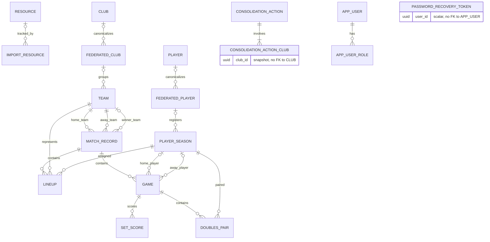

# RFETM Relational Data Model

## Scope and JPA conventions

This document describes the relational model implemented by the JPA entities in
`tt-data-league-core-repository-jpa`. It includes imported league data, import
bookkeeping, application authentication, settings, and consolidation audit
tables.

- Entities use Jakarta Persistence and application-assigned `UUID` identifiers.
  No entity configures `@GeneratedValue`.
- Enum fields use `@Enumerated(EnumType.STRING)`.
- Every `@ManyToOne` association is lazy and owns its explicit join column.
- The only `@OneToMany` collection is `ConsolidationActionJPA.clubs` (see
  [Consolidation audit tables](#consolidation-audit-tables)). League entities
  declare none: `MATCH` and `GAME` children are loaded through their
  repositories.
- Unless a column is explicitly marked otherwise below, its nullability and
  length are those declared by the entity.
- `source` is stored as a string enum with the values `RFETM`, `BCNESA`, and
  `FCTT`.
- `MATCH` is persisted as `match_record` to avoid a reserved-word collision.

## Enumerations

| Enum | Stored values |
| --- | --- |
| `Source` | `RFETM`, `BCNESA`, `FCTT` |
| `MatchStatus` | `SCHEDULED`, `PLAYED` |
| `GameType` | `INDIVIDUAL`, `DOUBLES` |
| `MatchResult` | `HOME`, `AWAY` |
| `Side` | `HOME`, `AWAY` |
| `UserRole` | `ADMIN`, `CLUB_MANAGER`, `ANALYST`, `PRACTITIONER` |
| `ResourceType` | `ACTAS`, `TEAMS` |
| `ImportResourceStatus` | `PENDING`, `PROCESSING`, `PROCESSED`, `ERROR` |
| `SettingCategory` | `GENERAL`, `IMPORT`, `NOTIFICATIONS` |
| `ConsolidationActionType` | `MERGE`, `SPLIT`, `RENAME` |
| `ConsolidationActionClubRole` | `SOURCE`, `TARGET` |

## League tables

### `resource`

Stored resource metadata.

| Column | Type | Null | Key/index |
| --- | --- | --- | --- |
| `id` | `UUID` | No | Primary key |
| `name` | `VARCHAR(255)` | No | — |
| `logic_path` | `VARCHAR(2000)` | No | `idx_resource_logic_path_name` |
| `physical_path` | `VARCHAR(2000)` | No | — |

The unique constraint `uk_resource_logic_path_name` covers
`(logic_path, name)`.

### `import_resource`

Import bookkeeping for a stored resource, per source and season.

| Column | Type | Null | Key/index |
| --- | --- | --- | --- |
| `id` | `UUID` | No | Primary key |
| `resource_id` | `UUID` | Yes | FK to `resource`; `idx_import_resource_resource_id` |
| `valid` | `BOOLEAN` | Yes | — |
| `type` | `VARCHAR` | No | `ResourceType` enum string |
| `created` | `TIMESTAMP WITH TIME ZONE` | No | — |
| `last_processed_date` | `TIMESTAMP WITH TIME ZONE` | Yes | — |
| `season` | `VARCHAR` | No | — |
| `source` | `VARCHAR` | No | `Source` enum string |
| `status` | `VARCHAR` | No | `ImportResourceStatus` enum string |

The unique constraint `uk_import_resource_resource_season_source` covers
`(resource_id, season, source)`. The `resource` association is a lazy
`@ManyToOne` with no cascade.

### `club`

Season-independent canonical club identity.

| Column | Type | Null | Key/index |
| --- | --- | --- | --- |
| `id` | `UUID` | No | Primary key |
| `name` | `VARCHAR(255)` | No | Unique; `idx_club_name` |

The table constraint is `uk_club_name`.

### `federated_club`

Source-specific club identity, optionally linked to a canonical `club`.

| Column | Type | Null | Key/index |
| --- | --- | --- | --- |
| `id` | `UUID` | No | Primary key |
| `source` | `VARCHAR(20)` | No | — |
| `name` | `VARCHAR(255)` | Yes | — |
| `club_id` | `UUID` | Yes | FK to `club`; `idx_federated_club_club_id` |

The unique constraint `uk_federated_club_source_name` covers
`(source, name)`. The indexes `idx_federated_club_name` and
`idx_federated_club_source_name` support name and source-scoped name lookup.
The `club` association is `@ManyToOne(fetch = LAZY)` with no cascade.

### `team`

Season-specific team registration, optionally linked to a source-specific
federated club.

| Column | Type | Null | Key/index |
| --- | --- | --- | --- |
| `id` | `UUID` | No | Primary key |
| `source` | `VARCHAR(20)` | Yes | — |
| `name` | `VARCHAR(255)` | Yes | — |
| `season` | `VARCHAR(10)` | Yes | — |
| `federated_club_id` | `UUID` | Yes | FK to `federated_club`; `idx_team_federated_club_id` |

The unique constraint `uk_team_name_season_source` covers
`(name, season, source)`. `idx_team_name_season` covers `(name, season)`.
The `federatedClub` association is `@ManyToOne(fetch = LAZY)` with no cascade.

### `player`

Season-independent canonical player identity. `license_id` stores the imported
source licence when available.

| Column | Type | Null | Key/index |
| --- | --- | --- | --- |
| `id` | `UUID` | No | Primary key |
| `name` | `VARCHAR(255)` | No | `idx_player_name` (not unique) |
| `license_id` | `VARCHAR(20)` | Yes | — |

Unlike `club`, `player` declares **no** unique constraint on `name`: the
`uk_player_name` declaration is commented out in `PlayerJPA`, so the database
does not prevent two canonical players with the same name. `findByName`
returns an `Optional`, so Spring Data throws
`IncorrectResultSizeDataAccessException` when duplicates exist.

### `federated_player`

Source-specific player identity, optionally linked to a canonical `player`.
`license_id` stores the imported source licence when available.

| Column | Type | Null | Key/index |
| --- | --- | --- | --- |
| `id` | `UUID` | No | Primary key |
| `source` | `VARCHAR(20)` | No | — |
| `name` | `VARCHAR(255)` | No | — |
| `license_id` | `VARCHAR(20)` | Yes | `idx_federated_player_source_license` with `source` |
| `player_id` | `UUID` | Yes | FK to `player`; `idx_federated_player_player_id` |

There is no table-level unique constraint on `(source, name)`. The indexes
`idx_federated_player_name` and `idx_federated_player_source_name` support
unscoped and source-scoped searches. The `player` association is
`@ManyToOne(fetch = LAZY)` with no cascade.

### `player_season`

Season-specific player registration. `license_id` is the source-system
registration identifier.

| Column | Type | Null | Key/index |
| --- | --- | --- | --- |
| `id` | `UUID` | No | Primary key |
| `source` | `VARCHAR(20)` | No | — |
| `name` | `VARCHAR(255)` | No | `idx_player_season_name` |
| `license_id` | `VARCHAR(20)` | No | — |
| `season` | `VARCHAR(10)` | Yes | `idx_player_season_season_license` |
| `federated_player_id` | `UUID` | Yes | FK to `federated_player`; `idx_player_season_federated_player_id` |

The unique constraint `uk_player_season_source_season_license` covers
`(source, season, name, license_id)`. The `federatedPlayer` association is
`@ManyToOne(fetch = LAZY)` with no cascade.

### `match_record`

Top-level team match event.

| Column | Type | Null | Key/index |
| --- | --- | --- | --- |
| `id` | `UUID` | No | Primary key |
| `source` | `VARCHAR(20)` | No | — |
| `external_id` | `VARCHAR(20)` | Yes | Unique; `idx_match_external_id` |
| `competition` | `VARCHAR(255)` | Yes | `idx_match_competition_season_group_round` |
| `season` | `VARCHAR(9)` | Yes | `idx_match_competition_season_group_round` |
| `group_num` | `INTEGER` | Yes | `idx_match_competition_season_group_round` |
| `round` | `INTEGER` | No | `idx_match_competition_season_group_round` |
| `phase` | `VARCHAR(255)` | Yes | — |
| `match_date` | `DATE` | Yes | — |
| `match_time` | `TIME` | Yes | — |
| `city` | `VARCHAR(255)` | Yes | — |
| `venue` | `VARCHAR(255)` | Yes | — |
| `home_team_id` | `UUID` | No | FK to `team`; `idx_match_home_team_id` |
| `away_team_id` | `UUID` | No | FK to `team`; `idx_match_away_team_id` |
| `referee_name` | `VARCHAR(255)` | Yes | — |
| `referee_license` | `VARCHAR(20)` | Yes | — |
| `home_games_won` | `INTEGER` | Yes | — |
| `away_games_won` | `INTEGER` | Yes | — |
| `home_sets_won` | `INTEGER` | Yes | — |
| `away_sets_won` | `INTEGER` | Yes | — |
| `winner_team_id` | `UUID` | Yes | FK to `team`; `idx_match_winner_team_id` |
| `protested` | `BOOLEAN` | No | Database default `false` |
| `status` | `VARCHAR(20)` | No | Database default `'PLAYED'` |

`status` is `SCHEDULED` while the fixture is known but not yet played, and `PLAYED` once results are
stored. The database default is what lets `ddl-auto: update` add this column to an already-populated
table: PostgreSQL backfills every existing row with `'PLAYED'`, matching what those rows already mean.
The invariant `status = SCHEDULED` implies no `lineup`, `game`, `set_score`, or `doubles_pair` rows for
the match, and a null `winner_team_id`, `home_games_won`, `away_games_won`, `home_sets_won`, and
`away_sets_won`. The domain enforces the header half of this (winner and games/sets won) in
`Match.of(...)`; the child half (no lineups, games, set scores, doubles pairs) is enforced by the match
writers, not by a database `CHECK` constraint. Legacy empty and "decided 0-0" rows stay `PLAYED` until
the FEAT-00078 backfill runs.

The unique constraints are:

- `uk_competition_season_group_round_teams` on
  `(competition, season, group_num, round, phase, home_team_id, away_team_id)`.
  `group_num` is nullable: a BCNESA Veterans "Other"-phase fixture (playoffs, promotion/relegation,
  finals) carries no group, and per SQL's null-handling this constraint does not dedupe two such
  fixtures by group alone (round, phase, and both teams still must differ).
- `uk_match_external_id` on `(external_id)`.

`homeTeam`, `awayTeam`, and `winnerTeam` are lazy `@ManyToOne` associations
to `team`. The winner association is nullable.

`competition` has no dedicated gender column; RFETM and FCTT both fold gender
into this value as `<competition-slug>-<masculino|femenino>` (for example
`tercera-nacional-masculino`, `copa-catalana-femenina-1a-femenino`). FCTT also
populates `phase` from the source payload's `fase` field, following BCNESA's
existing use of that column to disambiguate fixtures that reuse round numbers
across phases within the same group.

### `lineup`

Player assignment to a team and position in a match.

| Column | Type | Null | Key/index |
| --- | --- | --- | --- |
| `id` | `UUID` | No | Primary key |
| `source` | `VARCHAR(20)` | Yes | — |
| `match_id` | `UUID` | No | FK to `match_record`; `idx_lineup_match_id` |
| `team_id` | `UUID` | No | FK to `team`; `idx_lineup_team_id` |
| `letter` | `VARCHAR(2)` | No | — |
| `position` | `INTEGER` | No | — |
| `player_id` | `UUID` | No | FK to `player_season`; `idx_lineup_player_id` |
| `ranking` | `DECIMAL(10,2)` | Yes | — |

The unique constraint `uk_match_team_letter_position` covers
`(match_id, team_id, letter, position)`. `match`, `team`, and `player` are
lazy `@ManyToOne` associations.

### `game`

Individual singles or doubles game within a match.

| Column | Type | Null | Key/index |
| --- | --- | --- | --- |
| `id` | `UUID` | No | Primary key |
| `source` | `VARCHAR(20)` | No | — |
| `match_id` | `UUID` | No | FK to `match_record`; `idx_game_match_id` |
| `game_number` | `INTEGER` | No | Unique within match |
| `type` | `VARCHAR(10)` | No | `INDIVIDUAL` or `DOUBLES` |
| `crossover` | `VARCHAR(20)` | No | — |
| `home_player_id` | `UUID` | Yes | FK to `player_season`; `idx_game_home_player_id` |
| `away_player_id` | `UUID` | Yes | FK to `player_season`; `idx_game_away_player_id` |
| `home_sets_won` | `INTEGER` | Yes | — |
| `away_sets_won` | `INTEGER` | Yes | — |
| `winner` | `VARCHAR(4)` | Yes | `HOME` or `AWAY` |
| `cumul_home` | `INTEGER` | No | — |
| `cumul_away` | `INTEGER` | No | — |
| `not_played` | `BOOLEAN` | No | Database default `false` |
| `reason` | `VARCHAR(255)` | Yes | — |

The unique constraint `uk_match_game_number` covers `(match_id, game_number)`.
`match`, `homePlayer`, and `awayPlayer` are lazy `@ManyToOne` associations;
the player associations are nullable. `GameJPA` does not expose JPA
collections for sets or doubles pairs.

### `set_score`

Point score for one set in a game.

| Column | Type | Null | Key/index |
| --- | --- | --- | --- |
| `id` | `UUID` | No | Primary key |
| `source` | `VARCHAR(20)` | Yes | — |
| `game_id` | `UUID` | No | FK to `game`; `idx_set_score_game_id` |
| `set_number` | `INTEGER` | No | Unique within game |
| `home_points` | `INTEGER` | No | — |
| `away_points` | `INTEGER` | No | — |

The unique constraint `uk_set_score_game_set_number` covers
`(game_id, set_number)`. `game` is a lazy `@ManyToOne` association.

### `doubles_pair`

Player membership of a doubles game side.

| Column | Type | Null | Key/index |
| --- | --- | --- | --- |
| `id` | `UUID` | No | Primary key |
| `source` | `VARCHAR(20)` | Yes | — |
| `game_id` | `UUID` | No | FK to `game`; `idx_doubles_pair_game_id` |
| `side` | `VARCHAR(4)` | No | `HOME` or `AWAY` |
| `player_id` | `UUID` | No | FK to `player_season`; `idx_doubles_pair_player_id` |

The unique constraint `uk_doubles_pair_game_side_player_source` covers
`(game_id, side, player_id, source)`. `game` and `player` are lazy
`@ManyToOne` associations.

## Authentication tables

### `AppUser`

The entity declares the table name as `AppUser`.

| Column | Type | Null | Key/index |
| --- | --- | --- | --- |
| `id` | `UUID` | No | Primary key; not updatable |
| `username` | String | No | Unique; `idx_user_username` |
| `email` | String | No | Unique; `idx_user_email` |
| `password_hash` | String | No | — |
| `created_at` | `TIMESTAMP WITH TIME ZONE` | No | — |
| `is_active` | `BOOLEAN` | No | — |

`username` and `email` are unique both through their column mappings and the
unique indexes declared by `UserJPA`.

### `AppUserRole`

An element-collection table for `UserJPA.roles`, declared with
`@CollectionTable(name = "AppUserRole", joinColumns = @JoinColumn(name =
"user_id"))`.

| Column | Type | Null | Key/index |
| --- | --- | --- | --- |
| `user_id` | `UUID` | No | Join column to `AppUser.id` |
| `role` | `VARCHAR(30)` | No | Enum string |

The collection is initialized with the default role `PRACTITIONER`. No
explicit cascade or orphan-removal setting is declared on the collection.

### `PasswordRecoveryToken`

One-time password-recovery records. The raw token is not persisted; only its
SHA-256 hash is stored.

| Column | Type | Null | Key/index |
| --- | --- | --- | --- |
| `id` | `UUID` | No | Primary key; not updatable |
| `user_id` | `UUID` | No | Scalar user identifier |
| `token_hash` | `VARCHAR(64)` | No | Unique; `idx_recovery_token_hash` |
| `created_at` | `TIMESTAMP WITH TIME ZONE` | No | — |
| `expires_at` | `TIMESTAMP WITH TIME ZONE` | No | `idx_recovery_expiry` |
| `consumed` | `BOOLEAN` | No | — |

The table constraint is `uk_recovery_token_hash`. `user_id` is deliberately a
scalar UUID field; `PasswordRecoveryTokenJPA` does not declare a JPA
association to `UserJPA`.

## Repository lookup behavior

Spring Data helper repositories expose the following persistence lookups in
addition to ordinary CRUD operations:

| Repository | Lookup behavior |
| --- | --- |
| `ResourceRepositoryHelper` | Exact `(logic_path, name)`; all resources under a logic path. |
| `ImportResourceRepositoryHelper` | Exact `(source, type, season)`; rows by `(source, type)` newest first; rows by status; rows by source. |
| `ClubRepositoryHelper` | Exact canonical club name. |
| `PlayerRepositoryHelper` | Exact canonical player name (not unique; see `player`); specification queries. |
| `FederatedClubRepositoryHelper` | Source-scoped exact name, all rows by source, rows by canonical club id, and case-insensitive name searches (optionally source-scoped); list results can be sorted. Counts distinct trimmed, case-insensitive names. The adapter also supports fragment-based searches through specifications. |
| `FederatedPlayerRepositoryHelper` | Source-scoped exact name, source-scoped licence, and rows by canonical player id. Counts distinct trimmed, case-insensitive names. The adapter also supports fragment-based searches through specifications. |
| `TeamRepositoryHelper` | Exact `(name, season, source)`, first team by federated club and season, all teams by federated club (fetching the club), all teams by source, and case-insensitive name searches with optional season/source. Counts distinct federated clubs per season. |
| `PlayerSeasonRepositoryHelper` | Exact `(source, license, season)`, all rows by source, rows by federated player ids (fetching federated and canonical players), source-scoped players and their competitions for team ids through lineups. Counts distinct federated players per season. |
| `MatchRepositoryHelper` | Exact external id; natural-key lookup by competition, season, group, round, phase, home team, and away team (null group/phase match null); team-id searches optionally filtered by source, season, and competition; paginated source/season search with competition, date range, club-name and player-name fragments, player id, and home/away location, plus its count; paginated fragment search over team and player names; all matches by source; distinct seasons (overall or by source) and competitions by source and season; match count per season. |
| `LineupRepositoryHelper` | Rows for a match id (optionally ordered by team and position); rows for match ids or player-season ids (optionally paginated), fetching match, teams, clubs, and players. |
| `GameRepositoryHelper` | All games for a match id, or for a collection of match ids, ordered by match and `game_number` ascending. |
| `SetScoreRepositoryHelper` | Set scores for a collection of game ids, ordered by game and `set_number`. |
| `DoublesPairRepositoryHelper` | All doubles-pair rows for a collection of game ids, ordered by game, side, and id. |
| `UserRepositoryHelper` | Exact username/email lookup and existence checks; paginated case-insensitive username/email search, optionally filtered by active flag; count of active users per role. |
| `PasswordRecoveryTokenRepositoryHelper` | Active token lookup by hash; atomic conditional consumption by token id or user id. |
| `SettingRepositoryHelper` | Exact `(category, name)`; all settings in a category. |
| `ConsolidationActionRepositoryHelper` | All actions newest first; actions involving a club id snapshot, newest first. |

Repository queries that traverse teams, players, lineups, or matches apply
source predicates where the operation is source-scoped. The database natural
keys remain the final integrity boundary; repository method names do not
replace the declared constraints.

## Entity relationship summary

The associations are owned by the child entities:

```mermaid
erDiagram
    RESOURCE o|--o{ IMPORT_RESOURCE : tracked_by
    CLUB o|--o{ FEDERATED_CLUB : canonicalizes
    FEDERATED_CLUB o|--o{ TEAM : groups
    PLAYER o|--o{ FEDERATED_PLAYER : canonicalizes
    FEDERATED_PLAYER o|--o{ PLAYER_SEASON : registers
    TEAM ||--o{ MATCH_RECORD : home_team
    TEAM ||--o{ MATCH_RECORD : away_team
    TEAM o|--o{ MATCH_RECORD : winner_team
    MATCH_RECORD ||--o{ LINEUP : contains
    TEAM ||--o{ LINEUP : represents
    PLAYER_SEASON ||--o{ LINEUP : assigned
    MATCH_RECORD ||--o{ GAME : contains
    PLAYER_SEASON o|--o{ GAME : home_player
    PLAYER_SEASON o|--o{ GAME : away_player
    GAME ||--o{ SET_SCORE : scores
    GAME ||--o{ DOUBLES_PAIR : contains
    PLAYER_SEASON ||--o{ DOUBLES_PAIR : paired
    CONSOLIDATION_ACTION ||--|{ CONSOLIDATION_ACTION_CLUB : involves
    CONSOLIDATION_ACTION_CLUB {
        uuid club_id "snapshot, no FK to CLUB"
    }
    APP_USER ||--o{ APP_USER_ROLE : has
    PASSWORD_RECOVERY_TOKEN {
        uuid user_id "scalar, no FK to APP_USER"
    }
```

`SET_SCORE` and `DOUBLES_PAIR` point to `GAME` from their own entities.
Likewise, `MATCH_RECORD` and `GAME` do not expose inverse collection mappings.
Team and player season rows preserve season-specific identity; canonical club
and player links do not retarget historical match, lineup, game, or doubles
pair foreign keys.

`APP_USER`, `APP_USER_ROLE`, and `PASSWORD_RECOVERY_TOKEN` stand for the
`AppUser`, `AppUserRole`, and `PasswordRecoveryToken` tables. Two id columns
are deliberately drawn without a relationship line because they are not
foreign keys:

- `consolidation_action_club.club_id` is a snapshot of a club that the merge
  usually deletes; see [Consolidation audit tables](#consolidation-audit-tables).
- `PasswordRecoveryToken.user_id` is a scalar UUID with no JPA association to
  `UserJPA`; see [`PasswordRecoveryToken`](#passwordrecoverytoken).

## Settings

### `setting`

Application settings, one row per `(category, name)`. The table is separate
from deployment configuration and must never store datasource credentials, JWT
secrets, mail credentials, or other secrets.

| Column | Type | Null | Key/index |
| --- | --- | --- | --- |
| `id` | `UUID` | No | Primary key |
| `category` | `VARCHAR` | No | `SettingCategory` enum string; `idx_setting_category_name` |
| `name` | `VARCHAR(255)` | No | `idx_setting_category_name` |
| `value` | `VARCHAR(255)` | No | — |

The unique constraint `uk_setting_category_name` covers `(category, name)`.
`value` is a reserved word in several databases, so `SettingJPA` maps it as a
quoted identifier (`"value"`). There is no version column and no optimistic
locking.

## Consolidation audit tables

Every manual club consolidation (`POST /api/v1/clubs/consolidate`) writes one
historic record, so that a merge is no longer a silent, unrecoverable loss of
the merged-away clubs' identities. Automated import-time consolidation does not
write to these tables.

### `consolidation_action`

| Column | Type | Nullability | Notes |
|---|---|---|---|
| `id` | uuid | not null | Primary key |
| `type` | varchar | not null | `MERGE`, `SPLIT`, or `RENAME`; only `MERGE` is produced today |
| `occurred_on` | timestamptz | not null | Taken from the domain event, indexed by `idx_consolidation_action_occurred_on` |
| `performed_by_user_id` | uuid | nullable | The authenticated user; null when no principal was present |
| `performed_by_username` | varchar(255) | nullable | Username snapshot, kept when the user row is later deleted |
| `canonical_name` | varchar(255) | not null | The resulting name, i.e. the **post**-merge name |

### `consolidation_action_club`

One row per club taking part in the action, on either side.

| Column | Type | Nullability | Notes |
|---|---|---|---|
| `id` | uuid | not null | Primary key |
| `consolidation_action_id` | uuid | not null | FK to `consolidation_action` |
| `role` | varchar | not null | `SOURCE` (consumed by the action) or `TARGET` (survived it) |
| `club_id` | uuid | not null | See below; indexed by `idx_consolidation_action_club_club_id` |
| `club_name` | varchar(255) | not null | The club's name at the time of the action |

`club_id` is deliberately **not** a foreign key to `club`. A merge deletes every
`SOURCE` club row in the same operation that writes this record, so a foreign
key would either reject the insert or cascade away the audit trail these tables
exist to keep. Both `club_id` and `club_name` are snapshots: `SOURCE` ids
generally no longer resolve, and history must never be read back by resolving
them through `ClubRepository`.

`SOURCE` names are pre-merge while `canonical_name` is post-merge; that
asymmetry is intended and is what makes the record useful.

`ConsolidationActionJPA.clubs` is a lazy `@OneToMany(mappedBy = "action",
cascade = ALL, orphanRemoval = true)` collection, initialized to an empty list;
`ConsolidationActionClubJPA.action` is the owning lazy `@ManyToOne`. Saving an
action therefore persists its club rows, and deleting it removes them.
